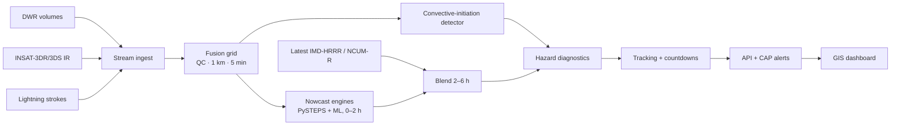

# VAJRA (वज्र) — Multi-source Convective Nowcasting for India

**Smart India Hackathon 2026 · Problem Statement 26084** — *Convective scale nowcasting for Thunderstorms, Hail & Cloudbursts (0–6 h)*
Sponsor: NCMRWF, Ministry of Earth Sciences · Theme: Disaster Management · Team **CodeX_2026** (159951)

> Guidance for IMD forecasters — not a public warning system by itself.

VAJRA fuses **Doppler Weather Radar** (reflectivity + velocity), **INSAT-3DR/3DS infrared imagery** and **ground lightning** data on a common 1 km grid every 5 minutes. It detects new storms early, nowcasts 0–2 h with optical flow and machine learning, blends with the latest existing NWP output for 2–6 h, forecasts each convective hazard separately, and shows a **live countdown to each storm's arrival window — with range and probability**.


## Key features

| Feature | Description |
|---|---|
| Multi-source fusion | Radar, INSAT IR and lightning on a 1 km grid, 5-minute clock |
| Radar quality control | Clutter / non-meteorological echo removal, attenuation correction |
| Early storm detection | Satellite cloud-top cooling before radar echoes appear |
| 0–2 h nowcast | PySTEPS optical flow + multi-source ML model |
| 2–6 h blending | Skill-weighted blend with the latest IMD-HRRR / NCUM-R output — no NWP run on demand |
| Lightning | Probability and flash density |
| Hail | Probability from reflectivity aloft / VIL density |
| Downburst | Outflow speed (m/s) from Doppler radial-velocity divergence |
| Cloudburst | IMD definition: ≥100 mm in 1 h over ~20–30 km² |
| Live countdowns | Countdown to each place's arrival window, with range and probability |
| Honest lead times | Per-hazard confidence at 0–1 h, 1–2 h, 2–6 h from verification |
| Graceful degradation | 1 km under radar; ~4 km satellite + lightning guidance elsewhere, labelled |
| Alerts | CAP 1.2 for IMD approval → SACHET, SMS/IVR, DAMINI in local languages |
| Latency target | Nowcast published ≤5 min after each radar scan (target; measured per stage) |

## Architecture



## Repository layout

```
VAJRA/
├── backend/            Python pipeline + FastAPI (starter modules with tests)
├── frontend/           Next.js + MapLibre dashboard (see prompts/)
├── config/             Example configuration (regions, places, thresholds)
├── data/samples/       Small sample data (large data is git-ignored)
├── docs/
│   ├── report/         Detailed Technical Report (PDF + source + figures)
│   ├── research/       Research notes and source library
│   ├── presentation/   SIH idea-submission deck (PDF)
│   ├── figures/        Diagrams used across documents
│   ├── ARCHITECTURE.md · METHODS.md · DATA_SOURCES.md
│   ├── VERIFICATION.md · API.md · DEMO_SCRIPT.md · ROADMAP.md
├── prompts/            Prototype build prompt
└── .github/            CI, issue and PR templates
```

## Documentation

| Document | |
|---|---|
| 📄 [Detailed Technical Report (PDF)](docs/report/VAJRA_Detailed_Report.pdf) | Full method, data, API, verification, risks |
| 🔬 [Research Notes](docs/research/PS26084_RESEARCH_NOTES.md) | Existing systems, the gap, literature, design evidence |
| 🎞️ [Idea Presentation (PDF)](docs/presentation/VAJRA_SIH2026_26084.pdf) | SIH 2026 submission deck |
| 🏗️ [Architecture](docs/ARCHITECTURE.md) · 🧪 [Methods](docs/METHODS.md) · 🗂️ [Data sources](docs/DATA_SOURCES.md) | |
| ✅ [Verification](docs/VERIFICATION.md) · 🔌 [API](docs/API.md) · 🎬 [Demo script](docs/DEMO_SCRIPT.md) · 🗺️ [Roadmap](docs/ROADMAP.md) | |

## Quick start (backend starter)

```bash
cd backend
python -m venv .venv && source .venv/bin/activate
pip install -r requirements.txt
pytest -q
```

The full system (dashboard, replay loop, nowcast engines) is built from [`prompts/PROTOTYPE_PROMPT.md`](prompts/PROTOTYPE_PROMPT.md).

## Data status

| Data | Status |
|---|---|
| INSAT-3DR/3DS | Open via MOSDAC (registration) |
| SEVIR (radar + IR + lightning) | Open — used for fusion pre-training |
| pysteps example radar data | Open — used to run the real nowcast engine |
| IMD DWR, IITM lightning, IMD-HRRR/NCUM-R | Requested; SIMULATED scenarios used until received |

Every output in the prototype is labelled **LIVE / REPLAY / SIMULATED**.

## Limitations

Point-scale forecasts of individual cells are not realistic beyond ~1–2 h; VAJRA shows area probabilities beyond demonstrated skill. Outside radar coverage, resolution is limited by INSAT IR (4 km). Downburst warnings have lead times of minutes. See the report for details.

## Team

CodeX_2026 — Smart India Hackathon 2026.

## License

[MIT](LICENSE). Third-party data remain under their own licences — see [DATA_SOURCES.md](docs/DATA_SOURCES.md).
