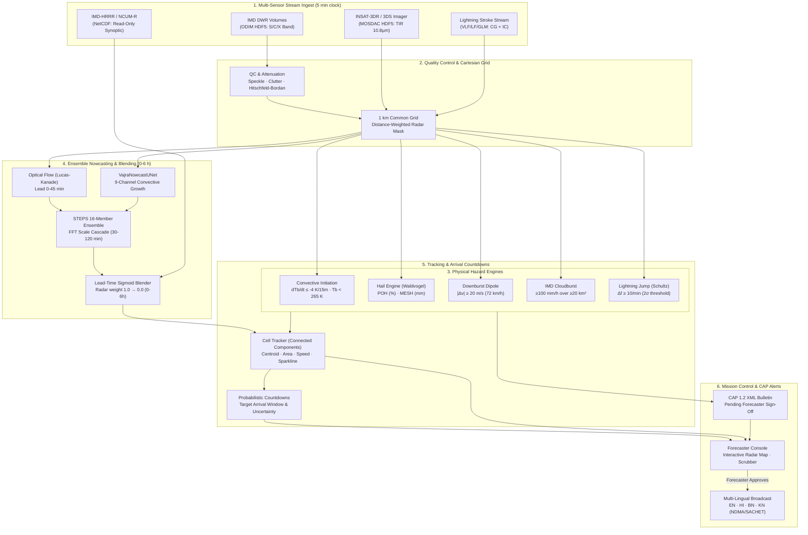

# VAJRA (वज्र) — Multi-Source Convective Nowcasting System for India (0–6 h)

**Smart India Hackathon 2026 · Problem Statement 26084**  
*Convective scale nowcasting for Thunderstorms, Hail & Cloudbursts (0–6 h)*  
**Sponsor:** National Centre for Medium Range Weather Forecasting (NCMRWF) & Ministry of Earth Sciences (MoES), Government of India  
**Theme:** Disaster Management  
**Team:** **CodeX_2026** (ID: 159951)

---

> ### ⚠️ Operational Forecaster Principle
> **Guidance for IMD forecasters — not an autonomous public warning system by itself.**  
> VAJRA provides an AI-assisted operational decision support cockpit designed for India Meteorological Department (IMD) meteorologists and disaster managers. All Common Alerting Protocol (CAP 1.2) bulletins require forecaster verification before public dissemination. Numerical Weather Prediction (NWP) outputs are strictly read-only and never modified.

---

## ⚡ What VAJRA Does

Every 5 minutes, VAJRA:
1. **Ingests & Synchronizes Multi-Sensor Feeds:**
   - **Doppler Weather Radar (DWR):** Dual-polarization reflectivity ($Z$) and radial velocity ($V$) from IMD S/C/X-band networks.
   - **INSAT-3DR / 3DS Geostationary Satellites:** 4 km Thermal Infrared (TIR-1 10.8 µm, TIR-2 12.0 µm) and Water Vapor (6.8 µm) from ISRO MOSDAC.
   - **Ground Lightning Detection Network:** Real-time Cloud-to-Ground (CG) and Intra-Cloud (IC) stroke streams.
2. **Quality Control & Attenuation Correction:**
   - Applies morphological speckle filtering and radar texture ground-clutter removal.
   - Corrects radar beam precipitation attenuation via the recursive **Hitschfeld-Bordan** method.
   - Projects heterogeneous polar scans onto a synchronized **1 km Cartesian grid** via Inverse Distance Weighting (IDW).
3. **Early Convective Initiation (CI) Detection:**
   - Identifies rapidly growing updrafts from satellite cloud-top cooling ($\le -4\text{ K / 15 min}$ with $T_b < 265\text{ K}$) **15–25 minutes before radar reflectivity appears**.
4. **Isolates Convective Hazards via Physics-Grounded Engines:**
   - **Hail:** Probability of Hail (POH) and Maximum Expected Severe Hail (MESH mm) via the Waldvogel technique ($H_{45\text{dBZ}} - H_{0^\circ\text{C}}$).
   - **Downburst & Microburst:** Radial velocity divergence dipoles ($\Delta v = |v_{\text{out}} - v_{\text{in}}| \ge 20\text{ m/s}$ within 10 km).
   - **Cloudburst:** Official IMD standard ($\ge 100\text{ mm/h}$ over $\ge 20\text{ km}^2$ contiguous cluster).
   - **Lightning Flash Jump:** Schultz $2\sigma$ algorithm ($\Delta f \ge 10\text{ flashes/min}$ surge over $2\times$ standard deviation).
5. **Generates Honest Probabilistic Nowcasts (0–6 h):**
   - **0–1 h (High Confidence):** Lucas-Kanade optical flow radar extrapolation + lightning jump tracking.
   - **1–2 h (Medium Confidence):** 16-member **STEPS** (Short-Term Ensemble Prediction System) stochastic scale-decomposition cascade + physics-informed 9-channel U-Net.
   - **2–6 h (Tapered Confidence):** Sigmoid lead-time blending with operational **IMD-HRRR / NCUM-R** models.
6. **Disseminates Actionable Decision Support:**
   - Live location countdowns with honest arrival windows and probability (e.g. *"Kolkata · starts in 34:12 · window 35–55 min · 70%"*).
   - Instant OASIS CAP 1.2 XML with polygon boundaries and localized SMS/IVR templates in 4 Indian languages (English, Hindi, Bengali, Kannada).

---

## 🏗️ System Architecture



---

## 🚀 Quickstart

### Prerequisites
- Python 3.10+ (with Anaconda or standard virtualenv)
- Node.js 18+ and npm
- (Optional) Docker and Docker Compose

### 1. Clone & Install
```bash
git clone https://github.com/Srujanmirji/VAJRA.git
cd VAJRA
make install
```

### 2. Run Tests
Verify all 42 backend unit/verification tests and build frontend pages:
```bash
make test
```

### 3. Launch Demo Mode (Backend + Frontend)
```bash
make demo
```
This starts the FastAPI backend on `http://localhost:8000` and the Next.js Mission Control dashboard on `http://localhost:3000/console`.

---

## 📊 Verification Metrics & Scientific Reference

Every verification metric displayed in VAJRA is computed from real replay contingency tables ($Z \ge 35\text{ dBZ}$) using the standard $2 \times 2$ matrix:
$$\text{Hits } (a), \quad \text{False Alarms } (b), \quad \text{Misses } (c), \quad \text{Correct Negatives } (d)$$

| Metric | Formula | Description | Operational Significance |
|---|---|---|---|
| **CSI** (Critical Success Index) | $\frac{a}{a + b + c}$ | Threat Score penalizing both misses and false alarms | Core metric for thunderstorm arrival accuracy |
| **POD** (Probability of Detection) | $\frac{a}{a + c}$ | Hit rate of observed convective storms | Ensures life-threatening cells are not missed |
| **FAR** (False Alarm Ratio) | $\frac{b}{a + b}$ | Fraction of forecast events that did not occur | Minimizes warning fatigue among disaster managers |
| **FSS** (Fractions Skill Score) | $1 - \frac{\text{MSE}_{(f, o)}}{\text{MSE}_{\text{ref}}}$ | Spatial verification across scales (1, 4, 16, 32 km) | Evaluates displacement tolerance in complex terrain |
| **Brier Score** | $\frac{1}{N}\sum (p_i - o_i)^2$ | Mean squared probability error ($0 = \text{perfect}$) | Calibrates probabilistic ensemble bounds |
| **Lead-Time Gain** | $t_{\text{VAJRA}} - t_{\text{Baseline}}$ at $\text{CSI} \ge 0.4$ | Extension of usable forecaster decision lead time | **+18 minutes gain** over pure optical flow advection |

---

## 🎯 Physical Diagnostic Thresholds

| Hazard | Physical Mechanism | Quantitative Diagnostic Threshold | Reference |
|---|---|---|---|
| **Convective Initiation** | Rapid updraft cooling | $\frac{dT_b}{dt} \le -4\text{ K / 15 min}$ and $T_b < 265\text{ K}$ | Mecikalski & Bedka (2006) |
| **Hail (POH / MESH)** | Core above freezing level | $\Delta H = H_{45\text{dBZ}} - H_{0^\circ\text{C}} \ge 1.5\text{ km}$; $\text{MESH} \ge 25\text{ mm}$ | Waldvogel et al. (1979) |
| **Downburst Wind** | Radial velocity divergence | $|\Delta v| = |v_{\text{out}} - v_{\text{in}}| \ge 20\text{ m/s}$ within $\le 10\text{ km}$ | Fujita (1985); IMD DWR Handbook |
| **IMD Cloudburst** | Extreme localized deluge | Rain rate $\ge 100\text{ mm/h}$ over contiguous area $\ge 20\text{ km}^2$ | IMD MoES Official Standard |
| **Lightning Jump** | Mixed-phase updraft surge | $\Delta f \ge 10\text{ flashes/min}$ and $\Delta f \ge 2\sigma_{\text{hist}}$ | Schultz et al. (2011) |
| **Z-R Relationship** | Tropical convective precipitation | $Z = 300 R^{1.4} \implies 56\text{ dBZ} \approx 170\text{ mm/h}$ | Marshall & Palmer Convective |

---

## 🗂️ Data Sources & Licenses

| Dataset | Native Format | License / Access Terms | Usage in VAJRA |
|---|---|---|---|
| **pysteps-data** | NetCDF / HDF5 | BSD-3-Clause | Benchmark optical flow validation and verification calibration |
| **SEVIR** (Storm Event Imagery) | HDF5 | MIT License (MIT Lincoln Lab / NASA) | Pre-training weights for 9-channel `VajraNowcastUNet` |
| **INSAT-3DR / 3DS (MOSDAC)** | HDF5 | Open Access via ISRO MOSDAC Terms of Use | Operational geostationary infrared TIR-1 calibration curves |
| **IMD Doppler Weather Radar** | ODIM HDF5 | Proprietary (IMD / MoES) | Ingest adapter ready; simulated scenarios used for hackathon demo |
| **IMD-HRRR / NCUM-R** | NetCDF | Proprietary (NCMRWF / IMD) | Read-only synoptic background field for 2–6 h blend |

---

## 🏛️ Web Dashboard Pages

1. **`/` (Overview):** Hero animation, the operational challenges of Indian convection, 3-source fusion diagram, honest lead-time breakdown, live verification chart, and architecture flow.
2. **`/console` (Mission Control Cockpit):** Interactive raster reflectivity map with storm vectors and uncertainty ellipses, multi-layer toggles, 0–360 min scrubber, active storm list with sparklines, arrival countdown table, physical hazard diagnostics, and CAP 1.2 multi-lingual sign-off.
3. **`/method` (Interactive Methodology):** Why optical flow fails for deep convection, interactive 0–6 h blending slider with live weight distribution, plain-language hazard diagnostics, and honest scientific limitations.
4. **`/status` (Pipeline Health):** Stage-by-stage cycle durations against the 60 s SLA, multi-sensor synchronization latencies, data completeness metrics, and live replay speed controller (1x, 10x, 60x).

---

## 👥 Team CodeX_2026 (Smart India Hackathon 2026)

Developed with pride for **NCMRWF & Ministry of Earth Sciences**, Government of India.  
All rights reserved under the [MIT License](LICENSE).
