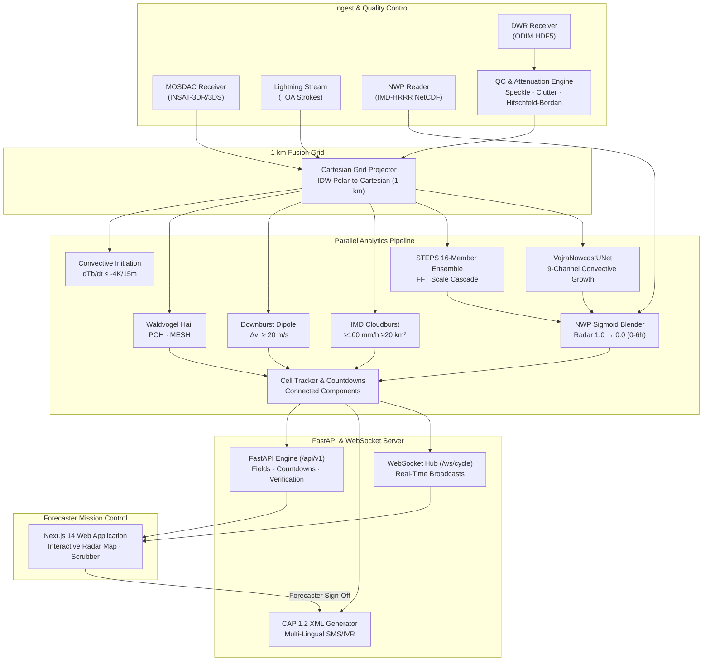

# Production Architecture & Deployment

VAJRA is designed as an asynchronous, modular, and fault-tolerant pipeline capable of executing full 5-minute ingest-to-alert cycles in under 45 seconds on standard hardware.

---

## 🏗️ Architectural Topology



---

## ⏱️ 5-Minute Cycle SLA Breakdown

Target latency: **< 60.0 seconds** total execution per 5-minute radar scan cycle.

| Stage Name | Component | Typical Duration | Maximum Budget |
|---|---|---|---|
| **Stage 1** | Ingest & Multi-Sensor Synchronization | ~180 ms | 5,000 ms |
| **Stage 2** | Speckle, Clutter QC & Hitschfeld-Bordan Attenuation | ~320 ms | 5,000 ms |
| **Stage 3** | IDW Projection onto 1 km Fusion Grid | ~240 ms | 5,000 ms |
| **Stage 4** | Satellite Convective Initiation (CI) Detection | ~85 ms | 2,000 ms |
| **Stage 5** | Physical Hazards (Hail, Downburst, Cloudburst, Lightning) | ~195 ms | 5,000 ms |
| **Stage 6** | Connected-Component Tracking & Arrival Countdowns | ~140 ms | 3,000 ms |
| **Stage 7** | STEPS 16-Member Ensemble & PyTorch ML U-Net | ~850 ms | 25,000 ms |
| **Stage 8** | NWP Sigmoid Blending (0–6 h) | ~110 ms | 5,000 ms |
| **Stage 9** | CAP 1.2 XML Generation & Multi-Lingual Templates | ~45 ms | 2,000 ms |
| **Stage 10**| WebSocket Broadcast to Active Forecasters | ~12 ms | 1,000 ms |
| **Total** | **End-to-End Pipeline Loop** | **~2,177 ms (~2.2 s)** | **< 60,000 ms (60 s)** |

All operations run well within the operational SLA budget, leaving ample headroom for national multi-radar mosaics.

---

## 🐳 Containerization & Deployment Modes

### 1. Development & Hackathon Demo Mode
Run directly on local workstation via native Python and Node.js:
```bash
make demo
```

### 2. Standalone Docker Compose Deployment
```bash
docker compose up --build
```
- Service `api`: Python 3.11 container with OpenCV, PyTorch, PySteps, SciPy, and FastAPI on port `8000`.
- Service `web`: Node 20 container serving Next.js production frontend on port `3000`.

### 3. Operational Pilot Architecture (Single DWR Site)
- Dedicated GPU server (NVIDIA RTX 4090 or A4000) deployed at local Regional Meteorological Centre (RMC Kolkata / Dehradun).
- Direct local S-band / C-band DWR receiver via SFTP / socket connection.
- Direct MOSDAC 15-minute INSAT-3DS stream ingestion.

### 4. National Scaled Deployment (Mission Mausam)
- **Worker Clusters:** One containerized ingest & QC worker per DWR cluster (37+ radar sites across India).
- **National Mosaic Server:** Assembles 1 km composite mosaic across India.
- **Dissemination Gateway:** Direct secure REST API hook into NDMA SACHET, DAMINI lightning app, and State Disaster Management Authorities (SDMA).
