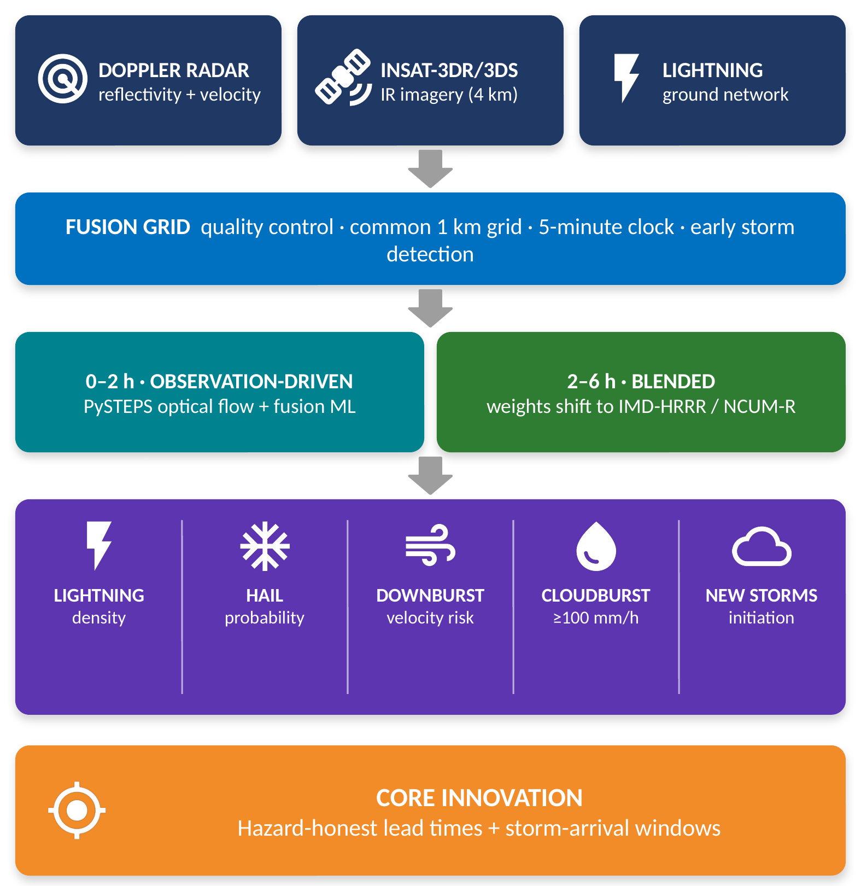
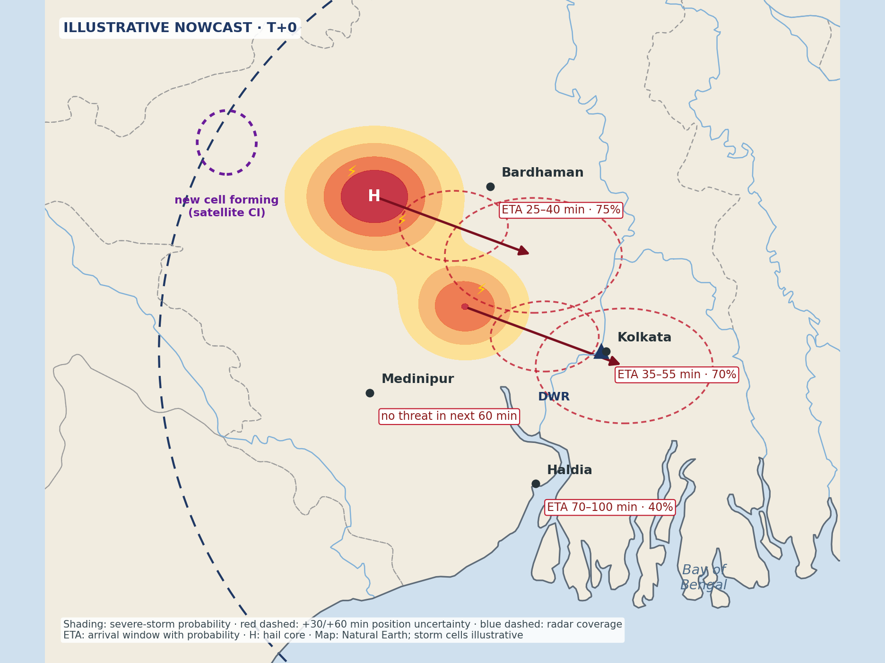
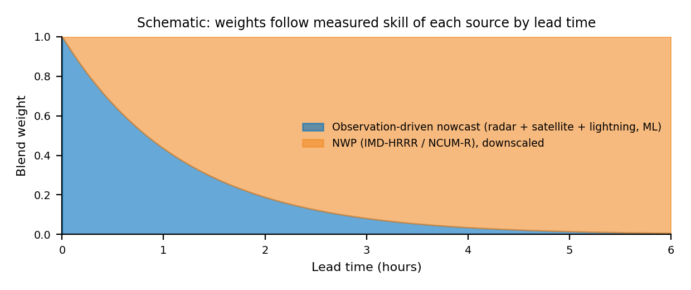

# VAJRA — Documentation index

| Document | Contents |
|---|---|
| [Detailed Technical Report (PDF)](report/VAJRA_Detailed_Report.pdf) | Method, hazards, blending, countdowns, API, verification, pilot, risks, references. Source: [report/report.md](report/report.md) |
| [Research Notes](research/PS26084_RESEARCH_NOTES.md) | Existing Indian systems, the gap, literature, physical constraints, data access |
| [Idea Presentation (PDF)](presentation/VAJRA_SIH2026_26084.pdf) | SIH 2026 idea-submission deck |
| [ARCHITECTURE.md](ARCHITECTURE.md) | Components, data flow, deployment |
| [METHODS.md](METHODS.md) | Fusion, initiation detection, nowcasting, blending, hazard diagnostics, countdowns |
| [DATA_SOURCES.md](DATA_SOURCES.md) | Every dataset, access route and licence |
| [VERIFICATION.md](VERIFICATION.md) | Metrics and evaluation protocol |
| [API.md](API.md) | REST + WebSocket endpoints |
| [DEMO_SCRIPT.md](DEMO_SCRIPT.md) | 3-minute demo |
| [ROADMAP.md](ROADMAP.md) | Phases from SIH to national deployment |

## Figures

| | |
|---|---|
|  |  |
|  |  |

*The nowcast map uses real geography (Natural Earth); storm cells are illustrative. The blend-weight chart is a schematic.*
