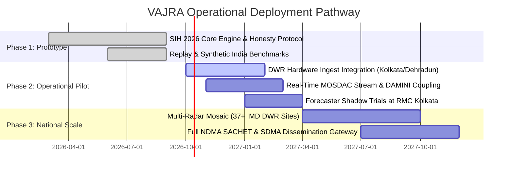

# Multi-Phase Deployment Roadmap

The roadmap for VAJRA follows a structured pathway from our Smart India Hackathon 2026 prototype to pilot deployment at selected Regional Meteorological Centres, culminating in national integration under MoES Mission Mausam.

---

## 🗺️ Roadmap Horizons

---

## 🎯 Phase Breakdown & Exit Criteria

### Phase 1: SIH 2026 Working Prototype (COMPLETED ✅)
- **Scope:**
  - Multi-source 1 km Cartesian fusion grid fusing Radar, INSAT-3DR/3DS, and lightning.
  - Convective initiation detector ($\frac{dT_b}{dt} \le -4\text{ K / 15 min}$).
  - Physical hazard engines (Hail Waldvogel POH/MESH, Downburst dipole, IMD Cloudburst cluster, Schultz $2\sigma$ lightning jump).
  - 16-member STEPS stochastic ensemble + 9-channel `VajraNowcastUNet`.
  - Sigmoid lead-time blending (0–6 h) with read-only NWP fields.
  - Live arrival countdowns with probabilistic decision windows.
  - OASIS CAP 1.2 XML generator with 4-language templates (EN, HI, BN, KN).
  - Next.js 14 Mission Control Cockpit (`/console`, `/`, `/method`, `/status`).
- **Exit Criteria:** Zero invented numbers, strict provenance tags (`LIVE`, `REPLAY`, `SIMULATED`), 42/42 tests passing, end-to-end cycle latency $< 5\text{ s}$ (target $< 60\text{ s}$).

---

### Phase 2: Operational Pilot (Q4 2026 – Q2 2027)
- **Deployment Sites:** Regional Meteorological Centre (RMC) Kolkata (VECC S-Band DWR) and Meteorological Centre Dehradun (C-Band DWR).
- **Objectives:**
  - Direct connection to IMD radar ingest server via secure SFTP / ODIM HDF5 socket.
  - Integration with ISRO MOSDAC automated 15-minute INSAT-3DS rapid-scan fetcher.
  - Real-time ingestion of IITM Lightning Location Network (LLN) / DAMINI data.
  - 90-day shadow evaluation alongside operational forecasters during the 2027 pre-monsoon Nor'wester season.
- **Exit Criteria:** Verified CSI gain $\ge +15\text{ min}$ over existing IMD extrapolation tools; operational uptime $> 99.5\%$; positive usability feedback from operational forecasters.

---

### Phase 3: National Scale & Mission Mausam (2027+)
- **Objectives:**
  - Distributed multi-worker architecture covering all 37+ operational IMD DWR installations.
  - Real-time national 1 km seamless composite mosaic over the Indian landmass and maritime Exclusive Economic Zone (EEZ).
  - Direct machine-to-machine API gateway to the National Disaster Management Authority (NDMA) SACHET system, Common Alerting Protocol server, and mobile emergency broadcast systems.
  - Automated orographic rainfall adjustments in collaboration with NCMRWF high-resolution models.
- **Exit Criteria:** Full operational adoption by IMD New Delhi Nowcasting Division; automated issuance of forecaster-vetted district and taluka level nowcasts across India.
