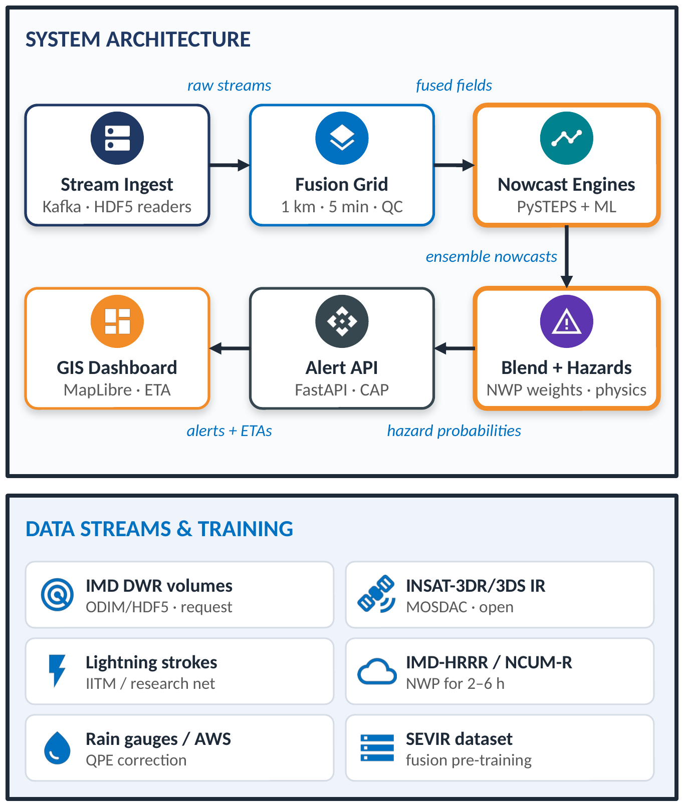

Smart India Hackathon 2026 · Problem Statement 26084

<h1 class="cover-title">VAJRA वज्र</h1>

Multi-source convective-scale nowcasting of thunderstorms, hail, downbursts and cloudbursts (0–6 h) with hazard-honest lead times

<b>Detailed Technical Report</b> 
Sponsoring organisation: National Centre for Medium Range Weather Forecasting (NCMRWF), Ministry of Earth Sciences 
Theme: Disaster Management · Category: Software 
Team: CodeX_2026 · Team ID: 159951 
Version 2.0 · September 2026

This report describes a proposed system and pilot plan at the idea-submission stage. Figures marked <i>Schematic</i> or <i>Illustrative</i> explain concepts and are not results. Quantitative facts are taken from the cited sources.

# Contents

1. Executive summary
2. Problem definition
3. Existing Indian capability and the gap
4. Design principles
5. System overview
6. Data ingestion and the fusion grid
7. Convective-initiation detection
8. Nowcast engines (0–2 h)
9. Blending with NWP (2–6 h)
10. Hazard diagnostics
11. Tracking and arrival windows
12. Dashboard, alerts and API
13. Data and training strategy
14. Verification plan
15. Pilot plan
16. Risks and mitigation
17. Impact and deployment pathway
18. Limitations
19. References

# 1. Executive summary

Severe convective storms — lightning, hail, downbursts and cloudbursts — develop within minutes at scales of a few kilometres. India's meteorological services already operate radar-based nowcasting: IMD adopted WDSS-II in 2006, adapted Hong Kong Observatory's SWIRLS-2 in 2018, and has implemented a PySTEPS nowcast module [1][2]. IITM's DAMINI provides lightning warnings up to about 40 minutes ahead [9]. Radar extrapolation skill, however, decreases rapidly with lead time; an Indian study extended useful lead from 0.5 to about 2 hours, with skill falling as lead time increases [3].

**VAJRA** is a fusion and post-processing system that runs on a 5-minute cycle and:

1. **Fuses** Doppler Weather Radar (reflectivity and velocity), INSAT-3DR/3DS infrared imagery and ground lightning observations on a common 1 km grid.
2. **Detects new storms early** from satellite cloud-top cooling and growth, before they appear on radar.
3. **Nowcasts 0–2 h** with an ensemble of optical-flow extrapolation (PySTEPS) and a multi-source machine-learning model.
4. **Blends with NWP for 2–6 h** (IMD-HRRR / NCUM-R), with weights set by each source's measured skill at each lead time.
5. **Forecasts each hazard separately** using physically based diagnostics: lightning density, hail probability, downburst risk and IMD's cloudburst criterion.
6. **Communicates honestly**: every hazard carries a confidence that depends on lead time, and each place gets a **live countdown to its storm-arrival window**, shown with the window range and probability.
7. **Alerts through official channels**: CAP messages for IMD approval, then SACHET, SMS/IVR and DAMINI in local languages.

Figure 1. VAJRA pipeline: three data sources, a common fusion grid, two nowcast engines by lead time, hazard-specific outputs, and hazard-honest lead times with arrival windows.

# 2. Problem definition

**Operational need.** Local administrations, aviation and rural communities need warnings with minutes to hours of lead time at kilometre scale. Numerical weather prediction at operational resolutions struggles to resolve individual convective cells, while observation-based extrapolation cannot create new storms and loses skill within about two hours.

**Physical constraints.**
- **Resolution.** INSAT-3D thermal infrared bands have 4 km × 4 km resolution; the visible band is 1 km [6]. Kilometre-scale (1–3 km) output is therefore achievable where Doppler radar coverage exists; elsewhere, guidance is at satellite resolution.
- **Cadence.** Full-disk INSAT imagery is available every 30 minutes, with a rapid-scan mode delivering imagery about every 4.5 minutes when activated [7].
- **Predictability.** Individual convective cells evolve within minutes; point-scale deterministic prediction beyond about 1–2 hours is not realistic. Area probabilities remain useful.

**Problem statement.**

> Provide 0–6 h nowcasts of convective hazards at 1–3 km wherever radar allows, fusing radar, satellite and lightning data, detecting new storms early, and stating the confidence of each hazard forecast honestly at each lead time.

# 3. Existing Indian capability and the gap

<table class="t">
<tr><th>System</th><th>Capability</th><th>Limitation</th></tr>
<tr><td>WDSS-II (IMD, 2006)</td><td>Radar severe-weather algorithms [1]</td><td>Radar-only</td></tr>
<tr><td>SWIRLS-2 (IMD, 2018)</td><td>Radar-led nowcasts of reflectivity, rainfall, tracks, lightning, squalls and hail, using radar, gauges, radiosondes and lightning [1][2]</td><td>Extrapolation-based; skill limited beyond ~1–2 h</td></tr>
<tr><td>PySTEPS module (IMD)</td><td>Probabilistic radar extrapolation [1]</td><td>No hazard-specific products</td></tr>
<tr><td>IMD-HRRR</td><td>High-resolution rapid-refresh NWP [3]</td><td>Not blended with observation nowcasts</td></tr>
<tr><td>DAMINI (IITM)</td><td>Lightning warnings up to ~40 min [9]</td><td>Single hazard</td></tr>
<tr><td>INSAT-3D/3DR/3DS</td><td>IR imagery via MOSDAC [6][7][8]</td><td>4 km IR; 30-min routine cadence</td></tr>
</table>

Table 1. Existing capability.

IMD has stated plans for nowcasts every 10 minutes at village-level resolution [4]. The gap VAJRA addresses is the combination of **multi-source fusion, hazard-specific probabilities, satellite-based early detection where radar is absent, and seamless 0–6 h blending with explicit confidence**.

# 4. Design principles

<table class="t">
<tr><th>Principle</th><th>Reason</th></tr>
<tr><td>Build on IMD's tools; use PySTEPS as the baseline</td><td>Every claimed gain is measured against what IMD already runs</td></tr>
<tr><td>Observation-driven for 0–2 h; NWP-blended for 2–6 h</td><td>Extrapolation skill falls within ~2 h; STEPS blending merges extrapolation with downscaled NWP [5]</td></tr>
<tr><td>Physics-based hazard diagnostics</td><td>Explainable to forecasters; grounded in established radar meteorology</td></tr>
<tr><td>Resolution follows the data</td><td>1 km only under radar; satellite-resolution guidance elsewhere, clearly labelled</td></tr>
<tr><td>Live countdowns with uncertainty</td><td>Countdowns run to the start of an arrival window and always show its range and probability, since storm motion is uncertain</td></tr>
<tr><td>Reuse NWP, never run it on demand</td><td>Blending reads the latest IMD-HRRR / NCUM-R output already produced, keeping the system real-time</td></tr>
<tr><td>Latency target</td><td>Nowcast published within ~5 minutes of each new radar volume (target, measured and displayed per stage)</td></tr>
<tr><td>Guidance for IMD, alerts via official channels</td><td>Public warnings remain IMD's responsibility</td></tr>
</table>

Table 2. Design principles.

# 5. System overview

Figure 2. System architecture and data streams.

Every 5 minutes: ingest new radar volumes, satellite images and lightning strokes → quality-control and regrid to a common 1 km grid → detect new storms → run nowcast engines → blend with the latest NWP → compute hazard probabilities → track storms and compute arrival windows → publish to the dashboard, API and CAP alert feed.

# 6. Data ingestion and the fusion grid

- **Radar:** volume scans (reflectivity and radial velocity) read with wradlib or Py-ART; quality control for ground clutter, anomalous propagation, speckle and non-meteorological echoes; attenuation correction where applicable; conversion to a Cartesian 1 km grid, with composite and constant-altitude products and vertically integrated liquid.
- **Satellite:** INSAT-3DR/3DS infrared brightness temperatures from MOSDAC HDF5, reprojected to the common grid (retaining native ~4 km resolution information), with parallax correction for tall clouds.
- **Lightning:** stroke locations and times aggregated into gridded flash density over 5- and 15-minute windows.
- **Streaming:** each source enters a message queue; the fusion grid is updated on a fixed 5-minute clock, with latency and completeness tracked per source.
- **Coverage mask:** each grid cell records which sources are available, so downstream confidence reflects data availability.

# 7. Convective-initiation detection

New storms are detected from satellite infrared signals that precede radar echoes: rapid cloud-top cooling, decreasing brightness temperatures through the freezing level, and growth of cold cloud area, following established satellite convective-initiation methods. Thresholds are taken from the literature and tuned on Indian cases. Candidate cells are cross-checked with lightning and, where available, early radar echoes. With routine 30-minute cadence, detection is coarse in time; rapid-scan imagery, when available, improves it substantially.

# 8. Nowcast engines (0–2 h)

**Baseline — optical-flow extrapolation (PySTEPS).** Motion vectors are estimated from successive radar fields (e.g., Lucas–Kanade), and fields are advected with a semi-Lagrangian scheme. A stochastic ensemble (STEPS) represents the growth and decay of small scales.

**Multi-source ML model.** A neural network takes recent sequences of radar reflectivity, infrared brightness temperature and lightning density as input channels and predicts the next two hours. To avoid the blurring typical of models trained on average error, a generative formulation is used (in the spirit of DGMR [11] and NowcastNet [12]), and outputs are evaluated with spatial metrics rather than average error alone. The model is pre-trained on SEVIR, which provides co-located radar, satellite and lightning events [13], then fine-tuned and validated on Indian cases.

**Ensemble.** Extrapolation and ML members together form an ensemble from which probabilities are computed.

# 9. Blending with NWP (2–6 h)

Beyond about two hours, observation-based skill declines while NWP retains useful skill for convective environments and organised systems. VAJRA blends the nowcast ensemble with downscaled NWP (IMD-HRRR or NCUM-R), following the STEPS blending approach [5]. Blend weights for each lead time are derived from measured skill of each component on past cases, so the transition is data-driven rather than fixed.

Figure 3. Schematic of blend weights versus lead time. Actual curves are fitted from verification.

# 10. Hazard diagnostics

<table class="t">
<tr><th>Hazard</th><th>Diagnostic basis</th><th>Output</th><th>Realistic lead</th></tr>
<tr><td>Lightning density</td><td>Observed flash rate and trends, radar reflectivity in the mixed-phase region, satellite cloud-top cooling</td><td>Probability of lightning and expected flash density per cell</td><td>Up to ~40–60 min for new cells; area probability beyond</td></tr>
<tr><td>Hail</td><td>High reflectivity aloft above the freezing level; vertically integrated liquid density; hail-size estimates from volume scans (e.g., MESH); dual-polarisation classification where available</td><td>Hail probability</td><td>0–60 min</td></tr>
<tr><td>Downburst</td><td>Low-level radial-velocity divergence, descending reflectivity cores and collapsing storm tops in consecutive volumes</td><td>Estimated outflow wind speed (m/s) and downburst risk</td><td>Minutes — treated as a warning</td></tr>
<tr><td>Cloudburst</td><td>IMD definition: 100 mm or more of rain in one hour over roughly 20–30 km² [10]; radar rainfall estimates corrected with gauges</td><td>Probability that 1-h rainfall exceeds 100 mm over a ≥20 km² cluster</td><td>0–1 h high; 1–6 h probabilistic via blending</td></tr>
<tr><td>New storms</td><td>Section 7</td><td>Initiation probability</td><td>~15–60 min before radar echoes</td></tr>
</table>

Table 3. Hazard diagnostics. Lead times are expectations to be replaced by measured skill.

**Hazard-honest lead times.** Each hazard's confidence is reported by lead time (0–1 h, 1–2 h, 2–6 h), derived from verification. Beyond the lead at which point-scale skill is no longer demonstrated, the product becomes an area probability or is withheld.

# 11. Tracking and arrival windows

Storm cells are identified by thresholding the fused fields and tracked across time steps. Each ensemble member gives a future position; for a location of interest, the distribution of arrival times across members yields an **arrival window** (e.g., 35–55 minutes) and a **probability** of arrival within the next hour. The dashboard shows a **live countdown** to the start of the window, together with the window width and probability — meeting the problem statement's countdown requirement without false precision.

Figure 4. Illustrative nowcast on real geography (Natural Earth), Kolkata region: severe-storm probability, position uncertainty at +30/+60 min, a satellite-detected new cell outside the main storms, and arrival windows for nearby towns. Storm cells are illustrative.

# 12. Dashboard, alerts and API

- **GIS dashboard** (Next.js + MapLibre): hazard layers at 1 km under radar, a lead-time slider, storm tracks with uncertainty, arrival windows for selected locations, a data-availability layer, and a skill panel.
- **Alerts:** Common Alerting Protocol (CAP) messages for IMD to authorise and disseminate through SACHET, SMS/IVR and DAMINI, with templates in local languages (e.g., Hindi, Bengali, Kannada, English).
- **API** (FastAPI): REST endpoints for hazard probabilities, cells and arrival windows, with push updates each cycle.

<pre>
GET /nowcast/latest/hazards?type=hail&amp;lead=30
GET /cells/{cell_id}
GET /eta?lat=22.57&amp;lon=88.36
{
  "location": "Kolkata", "hazard": "thunderstorm",
  "arrival_window_min": [35, 55], "p_arrival_60min": 0.70,
  "confidence": "high (0-1 h)",
  "label": "Guidance for IMD forecasters"
}
</pre>

# 13. Data and training strategy

<table class="t">
<tr><th>Data</th><th>Access</th><th>Use</th></tr>
<tr><td>IMD DWR volumes</td><td>Requested via SIH SPOC</td><td>Case studies, fine-tuning, verification</td></tr>
<tr><td>INSAT-3DR/3DS IR</td><td>MOSDAC, free registration</td><td>Initiation detection, fusion input</td></tr>
<tr><td>Lightning (IITM network)</td><td>Requested; research networks share data for non-commercial use [9]</td><td>Fusion input, verification</td></tr>
<tr><td>IMD-HRRR / NCUM-R</td><td>Requested</td><td>2–6 h blending</td></tr>
<tr><td>SEVIR</td><td>Open</td><td>Pre-training on co-located radar, satellite and lightning [13]</td></tr>
<tr><td>Rain gauges / AWS</td><td>IMD</td><td>Rainfall correction, cloudburst verification</td></tr>
</table>

Table 4. Data sources.

Co-located radar, satellite and lightning archives are not openly available for India, so the fusion model is pre-trained on SEVIR and adapted to Indian conditions with whatever Indian cases are obtained. This limitation is stated explicitly in all results.

# 14. Verification plan

<table class="t">
<tr><th>Question</th><th>Metric</th></tr>
<tr><td>Are storm areas forecast correctly?</td><td>Critical Success Index, probability of detection and false-alarm ratio at reflectivity/rain thresholds</td></tr>
<tr><td>At what scale is the forecast skilful?</td><td>Fractions Skill Score by neighbourhood size and lead time</td></tr>
<tr><td>Are hazard probabilities reliable?</td><td>Brier score and reliability diagrams per hazard</td></tr>
<tr><td>How much lead time is gained?</td><td>Lead time at which skill falls below a threshold, versus the PySTEPS baseline</td></tr>
<tr><td>Are arrival windows accurate?</td><td>Observed arrival within window (coverage) and timing error</td></tr>
</table>

Table 5. Verification metrics.

# 15. Pilot plan

**Cases:** pre-monsoon nor'westers in the Kolkata region, and one Himalayan cloudburst event, subject to data availability.

<table class="t">
<tr><th>Phase</th><th>Weeks</th><th>Output</th></tr>
<tr><td>Data access and ingestion</td><td>1–3</td><td>MOSDAC ingestion; SEVIR pipeline; data requests</td></tr>
<tr><td>Baseline</td><td>2–4</td><td>PySTEPS nowcasts and verification</td></tr>
<tr><td>Fusion model</td><td>3–7</td><td>SEVIR pre-training; Indian fine-tuning</td></tr>
<tr><td>Initiation and hazards</td><td>4–7</td><td>Satellite initiation; hail, lightning, downburst, cloudburst diagnostics</td></tr>
<tr><td>Blending and ETA</td><td>6–8</td><td>NWP blending (if data obtained); arrival windows</td></tr>
<tr><td>Dashboard and alerts</td><td>5–9</td><td>GIS dashboard, CAP output, case replay</td></tr>
</table>

Table 6. Pilot schedule.

# 16. Risks and mitigation

<table class="t">
<tr><th>Risk</th><th>Level</th><th>Mitigation</th></tr>
<tr><td>No open Indian radar/lightning data</td><td class="hi">High</td><td>SEVIR pre-training; MOSDAC; formal data requests</td></tr>
<tr><td>Over-claiming 6 h skill</td><td class="hi">High</td><td>Per-hazard skill curves; NWP blending beyond ~2 h</td></tr>
<tr><td>Blurry ML forecasts</td><td class="md">Medium</td><td>Generative formulation; spatial verification</td></tr>
<tr><td>Satellite IR resolution (4 km)</td><td class="md">Medium</td><td>1 km only under radar; labelled confidence elsewhere</td></tr>
<tr><td>Very short downburst lead</td><td class="md">Medium</td><td>Treated as a warning product</td></tr>
<tr><td>Duplicating IMD tools</td><td class="lo">Low</td><td>PySTEPS as baseline; VAJRA adds fusion, hazards and blending</td></tr>
</table>

Table 7. Risk register.

# 17. Impact and deployment pathway

<table class="t">
<tr><th>User</th><th>Benefit</th></tr>
<tr><td>IMD nowcast desks</td><td>One fused view of all convective hazards with confidence</td></tr>
<tr><td>Disaster managers</td><td>Arrival windows to move people and teams</td></tr>
<tr><td>Aviation</td><td>Hail and downburst zones on airport approach paths</td></tr>
<tr><td>Farmers (via IMD advisories)</td><td>Hail and lightning warnings by SMS/IVR and DAMINI in local languages</td></tr>
</table>

Table 8. Expected impact, to be validated in the pilot.

**Pathway:** Phase 1 — SIH case replays; Phase 2 — live pilot with one IMD radar, INSAT and lightning; Phase 3 — national deployment across the expanding Mission Mausam radar network, with alerts through SACHET, SMS/IVR and DAMINI.

# 18. Limitations

- Point-scale deterministic forecasts of individual cells are not possible beyond roughly 1–2 hours; VAJRA reports area probabilities beyond demonstrated skill.
- Outside radar coverage, resolution is limited by INSAT IR (4 km) and cadence.
- Downburst warnings have lead times of minutes.
- Fusion training relies on SEVIR (US data) until sufficient Indian co-located data are available.
- Quality depends on timely access to radar, lightning and NWP data.

# 19. References

1. Operational assessment of radar-based nowcasting tools in IMD. <i>Atmosphere</i>, 15(2):154, 2024. <a href="https://doi.org/10.3390/atmos15020154">Link</a>
2. SWIRLS nowcasting with Indian Doppler Weather Radar data. <i>MAUSAM</i>. <a href="https://mausamjournal.imd.gov.in/index.php/MAUSAM/article/view/1442">Link</a>
3. Radar-based nowcasting over Northeast India. <i>Journal of Earth System Science</i>, 2025. <a href="https://link.springer.com/article/10.1007/s12040-025-02649-4">Link</a>
4. IMD press release, 14 January 2025. <a href="https://internal.imd.gov.in/press_release/20250114_pr_3552.pdf">Link</a>
5. Four-hour thunderstorm nowcasting using a deep diffusion model of satellite data (discusses STEPS blending). arXiv:2404.10512. <a href="https://arxiv.org/pdf/2404.10512">Link</a>
6. MOSDAC — INSAT-3D payloads. <a href="https://mosdac.gov.in/insat-3d-payloads?language=en">Link</a>
7. INSAT-3DR rapid-scan observations. <i>Current Science</i>, 120(6). <a href="https://www.currentscience.ac.in/Volumes/120/06/1026.pdf">Link</a>
8. MOSDAC — INSAT-3DS. <a href="https://www.mosdac.gov.in/insat-3s-introduction?language=en">Link</a>
9. IIT Madras Shaastra — India's lightning networks and DAMINI. <a href="https://shaastramag.iitm.ac.in/special-feature/bolt-blue">Link</a>
10. Cloudbursts explainer (IMD definition). <a href="https://www.climate.rocksea.org/cloudbursts/">Link</a>
11. Ravuri, S. et al. Skilful precipitation nowcasting using deep generative models of radar. <i>Nature</i>, 2021. <a href="https://www.nature.com/articles/s41586-021-03854-z">Link</a>
12. Zhang, Y. et al. Skilful nowcasting of extreme precipitation with NowcastNet. <i>Nature</i>, 2023. <a href="https://www.nature.com/articles/s41586-023-06184-4">Link</a>
13. Veillette, M. et al. SEVIR: a storm event imagery dataset. NeurIPS 2020. <a href="https://sevir.mit.edu/">Link</a>
14. Pulkkinen, S. et al. Pysteps: an open-source Python library for probabilistic precipitation nowcasting. <i>Geoscientific Model Development</i>, 2019. <a href="https://pysteps.github.io/">Link</a>
15. Nowcast3D: 3D radar-based nowcasting. arXiv:2511.04659. <a href="https://arxiv.org/pdf/2511.04659">Link</a>
